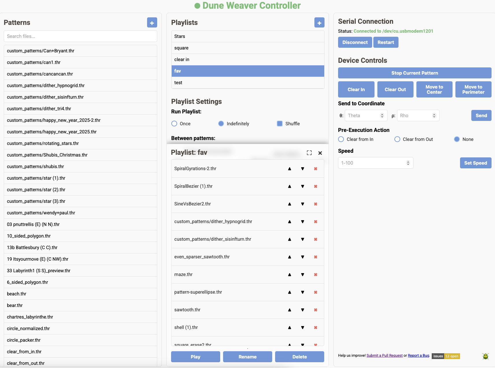
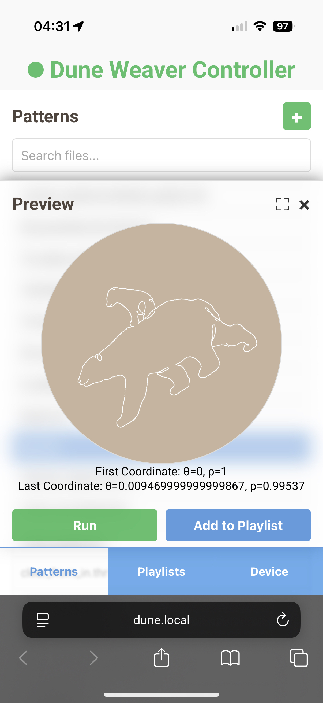

# Changelog

All notable changes to this project will be documented in this file.

## [1.4.0] Soft- and Firmware updater

### Added

- Added Software Updater to make it easier to update the app and get the latest firmware updates for the Arduino
- Added Firmware updater to make it possible to flash the Firmware from the web app.
- Included Icons in UI

### Changed
- Moved Roboto font files locally
- Made notifications clickable with a 3rd optional parameter

## [1.3.0] Revamped UI

Massive thanks to Thokoop for helping us redesigning the UI just within a few days! The new design looks gorgeous on both PC and mobile. 

## [1.2.0] - Playlist mode, Spirograph functionality

### Added

#### Playlist mode

- Added UI selection mode for single pattern run, create a playlist, and run a playlist. The UI is work in progress and will be changed in the near future.
- Created playlist will be saved as a JSON file on disk. There are options to:
  - Run the playlist once or on an indefinite loop
  - Shuffle the playlist
  - Add a clear pattern between files that will run immmidiately before each pattern. If you would like to customize the clear pattern, select None here and add clear patterns manually.
  - Add a pause time (in second) between each pattern.

#### Spirograph mode

- Added support for Spirograph mode for the arduino with DRV8825 or TMC2209 motor drivers
- Can be used if optional hardware (two potentiometers and a button) is connected.

### Changed

- Fixed a bug that created conflicting threads, leading to serial errors
- Fixed a bug that caused the speed setting functionality to not work
- Fixed a bug that caused the ball to move in slightly when a pattern starts at the perimeter and theta != 0

### Known issues

- Patterns with theta does not start with 0 will behave abnormally. To get around this, be sure to select start from center or perimeter when creating your pattern in sandify.org.

## [1.1.0] - Auto connect functionality

### Added
- **Auto-connect Serial Connection when app is started**
    - Automatically selected the first available serial port if none was specified.
- **Added Footer with:**
  - Links to github
  - Toggle button to show/hide the debug log

### Changed
- **Improved UI**
  - Certain buttons are now only visible when it's applicable for the current state.
  - Moved Stop button and Speed input to Quick Actions**
- **Pattern file prioritization:**
    - Updated the `/list_theta_rho_files` endpoint to:
        - Only display files with the `.thr` extension.
        - Include `custom_patterns/default_pattern.thr` at the top of the list if it exists.
        - Prioritize files in the `custom_patterns/` folder over other files.

## [1.0.0] - Initial Version
- Initial implementation of the Flask application to control the Dune Weaver sand table.
- Added core functionality for:
    - Serial port connection and management.
    - Parsing `.thr` files (theta-rho format).
    - Executing patterns via Arduino.
    - Basic Flask endpoints for listing, uploading, and running `.thr` files.
