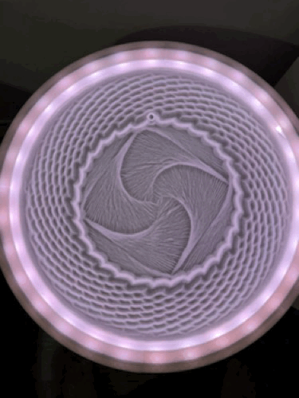

# Dune Weaver

Dune Weaver is a project for a mesmerizing, motorized sand table that draws intricate patterns in sand using a steel ball moved by a magnet. This project combines hardware and software, leveraging an Arduino for hardware control and a Python/Flask-based web interface for interaction. 

### **Check out the wiki [here](https://github.com/tuanchris/dune-weaver/wiki/Wiring) for more details.**

---

The Dune Weaver comes in two versions:

1. **Small Version (Mini Dune Weaver)**:
   - Uses two **28BYJ-48 DC 5V stepper motors**.
   - Controlled via **ULN2003 motor drivers**.
   - Powered by an **ESP32**.

2. **Larger Version (Dune Weaver)**:
   - Uses two **NEMA 17 or NEMA 23 stepper motors**.
   - Controlled via **TMC2209 or DRV8825 motor drivers**.
   - Powered by an **Arduino UNO with a CNC shield**.

Each version operates similarly but differs in power, precision, and construction cost.

The sand table consists of two main bases:
1. **Lower Base**: Houses all the electronic components, including motor drivers, and power connections.
2. **Upper Base**: Contains the sand and the marble, which is moved by a magnet beneath.

Both versions of the table use two stepper motors:

- **Radial Axis Motor**: Controls the in-and-out movement of the arm.
- **Angular Axis Motor**: Controls the rotational movement of the arm.

The small version uses **28BYJ-48 motors** driven by **ULN2003 drivers**, while the larger version uses **NEMA 17 or NEMA 23 motors** with **TMC2209 or DRV8825 drivers**.: Controls the in-and-out movement of the arm.
- **Angular Axis Motor**: Controls the rotational movement of the arm.

Each motor is connected to a motor driver that dictates step and direction. The motor drivers are, in turn, connected to the ESP32 board, which serves as the system's main controller. The entire table is powered by a single USB cable attached to the ESP32.

---

## Coordinate System
Unlike traditional CNC machines that use an **X-Y coordinate system**, the sand table operates on a **theta-rho (θ, ρ) coordinate system**:
- **Theta (θ)**: Represents the angular position of the arm, with **2π radians (360 degrees) for one full revolution**.
- **Rho (ρ)**: Represents the radial distance of the marble from the center, with **0 at the center and 1 at the perimeter**.

This system allows the table to create intricate radial designs that differ significantly from traditional Cartesian-based CNC machines.

---

## Homing and Position Tracking
Unlike conventional CNC machines, the sand table **does not have a limit switch** for homing. Instead, it uses a **crash-homing method**:
1. Upon power-on, the radial axis moves inward to its physical limit, ensuring the marble is positioned at the center.
2. The software then assumes this as the **home position (0,0 in polar coordinates)**.
3. The system continuously tracks all executed coordinates to maintain an accurate record of the marble’s position.

---

## Mechanical Constraints and Software Adjustments
### Coupled Angular and Radial Motion
Due to the **hardware design choice**, the angular axis **does not move independently**. This means that when the angular motor moves one full revolution, the radial axis **also moves slightly**—either inwards or outwards, depending on the rotation direction.

To counteract this behavior, the software:
- Monitors how many revolutions the angular axis has moved.
- Applies an offset to the radial axis to compensate for unintended movements.

This correction ensures that the table accurately follows the intended path without accumulating errors over time.

---

## Software Architecture
The project is built on a combination of C++, Python, and JavaScript:
1. **Motor Control (C++)**:
   - Runs on the ESP32 or Arduino Uno and handles precise motor movements.
2. **Backend Communication (Python)**:
   - Runs on a computer or Raspberry Pi, sending pattern data to the ESP32 or Arduino Uno.
3. **Web Interface (JavaScript/HTML/CSS)**:
   - Provides an intuitive frontend for users to control the sand table remotely.
