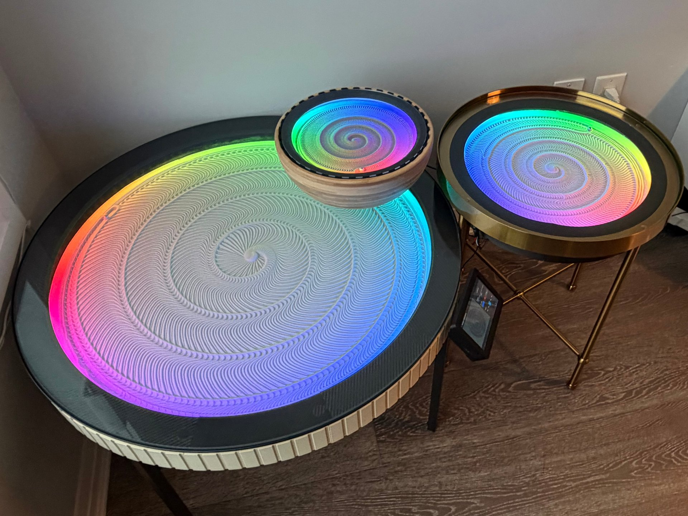

# Dune Weaver

[](https://www.patreon.com/cw/DuneWeaver)



**An open-source kinetic sand art table that creates mesmerizing patterns using a ball controlled by precision motors.**

## Features

- **Modern React UI** — A responsive, touch-friendly web interface that installs as a PWA on any device
- **Pattern Library** — Browse, upload, and manage hundreds of sand patterns with auto-generated previews
- **Live Preview** — Watch your pattern come to life in real time with progress tracking
- **Playlists** — Queue up multiple patterns with configurable pause times and automatic clearing between drawings
- **LED Integration** — Synchronized lighting via native DW LEDs or WLED, with separate idle, playing, and scheduled modes
- **Still Sands Scheduling** — Set quiet hours so the table pauses automatically on your schedule
- **Multi-Table Support** — Control several sand tables from a single interface
- **Home Assistant Integration** — Connect to Home Assistant or other home automation systems using MQTT
- **Auto-Updates** — One-click software updates right from the settings page
- **Add-Ons** — Optional [Desert Compass](https://duneweaver.com/docs) for auto-homing and [DW Touch](https://duneweaver.com/docs) for dedicated touchscreen control

## How It Works

The system is split across two devices connected via USB:

```
┌─────────────────┐         USB          ┌─────────────────┐
│  Raspberry Pi   │ ◄──────────────────► │  DLC32 / ESP32  │
│  (Dune Weaver   │                      │  (FluidNC)      │
│   Backend)      │                      │                 │
└─────────────────┘                      └─────────────────┘
        │                                        │
        │ Wi-Fi                                  │ Motor signals
        ▼                                        ▼
   Web Browser                            Stepper Motors
   (Control UI)                           (Theta & Rho)
```

The **Raspberry Pi** runs the web UI, manages pattern files and playlists, and converts patterns into G-code. The **DLC32/ESP32** running [FluidNC](https://github.com/bdring/FluidNC) firmware receives that G-code and drives the stepper motors in real time.

## Hardware

Dune Weaver comes in three premium models:

| | [DW Pro](https://duneweaver.com/products/dwp) | [DW Mini Pro](https://duneweaver.com/products/dwmp) | [DW Gold](https://duneweaver.com/products/dwg) |
|---|---|---|---|
| **Size** | 75 cm (29.5") | 25 cm (10") | 45 cm (17") |
| **Enclosure** | IKEA VITTSJÖ table | IKEA BLANDA bowl | IKEA TORSJÖ side table |
| **Motors** | 2 × NEMA 17 | 2 × NEMA 17 | 2 × NEMA 17 |
| **Controller** | DLC32 | DLC32 | DLC32 |
| **Best for** | Living rooms | Desktops | Side-table accent piece |

All models run the same software with [FluidNC](https://github.com/bdring/FluidNC) firmware — only the mechanical parts differ.

Free 3D-printable models on MakerWorld: [DW OG](https://makerworld.com/en/models/841332-dune-weaver-a-3d-printed-kinetic-sand-table#profileId-787553) · [DW Mini](https://makerworld.com/en/models/896314-mini-dune-weaver-not-your-typical-marble-run#profileId-854412)

> **Build guides, BOMs, and wiring diagrams** are in the [Dune Weaver Docs](https://duneweaver.com/docs).

## Quick Start

The fastest way to get running on a Raspberry Pi:

```bash
curl -fsSL https://raw.githubusercontent.com/tuanchris/dune-weaver/main/setup-pi.sh | bash
```

This installs Docker, clones the repo, and starts the application. Once it finishes, open **http://\<hostname\>.local** in your browser.

For full deployment options (Docker, manual install, development setup, Windows, and more), see the **[Deploying Backend](https://duneweaver.com/docs/deploying-backend)** guide.

### Polar coordinates

The sand table uses **polar coordinates** instead of the typical X-Y grid:

- **Theta (θ)** — the angle in radians (2π = one full revolution)
- **Rho (ρ)** — the distance from the center (0.0 = center, 1.0 = edge)

Patterns are stored as `.thr` text files — one coordinate pair per line:

```
# A simple four-point star
0.000 0.5
1.571 0.7
3.142 0.5
4.712 0.7
```

The same pattern file works on any table size thanks to the normalized coordinate system. You can create patterns by hand, generate them with code, or browse the built-in library.

## Documentation

Full setup instructions, hardware assembly, firmware flashing, and advanced configuration:

**[Dune Weaver Docs](https://duneweaver.com/docs)**

## Contributing

We welcome contributions! See the [Contributing Guide](CONTRIBUTING.md) for how to get started.

---

**Happy sand drawing!**
